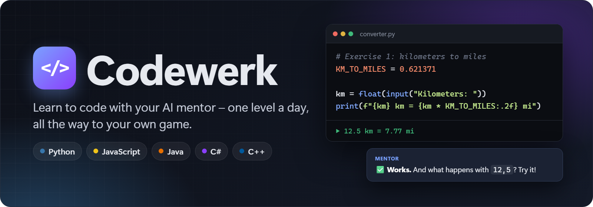
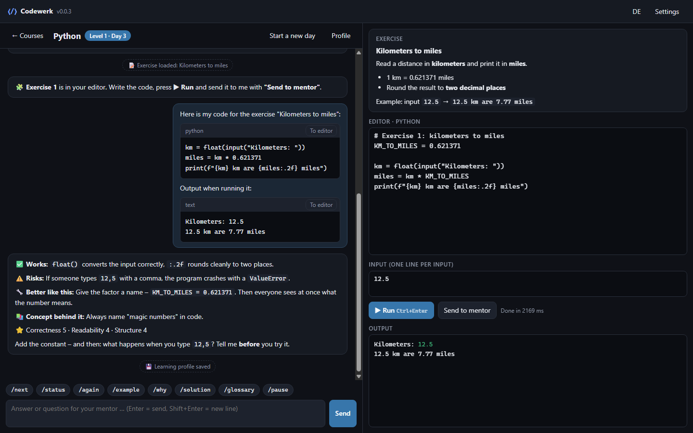
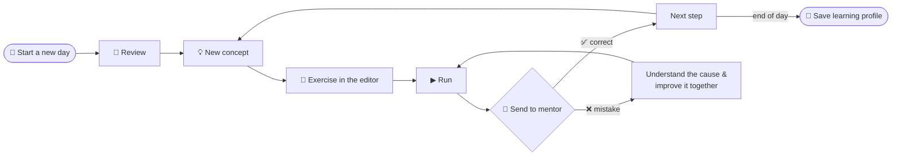
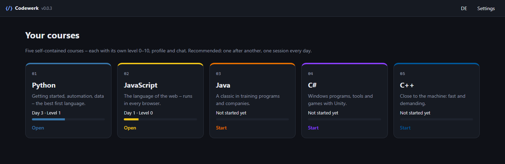
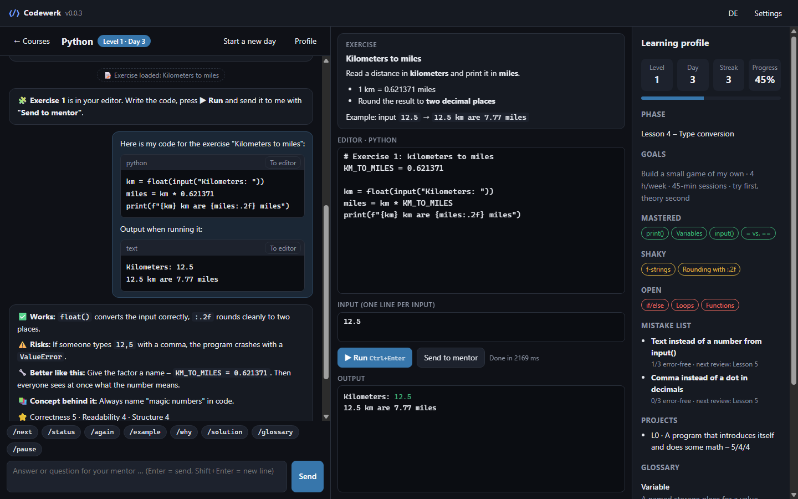
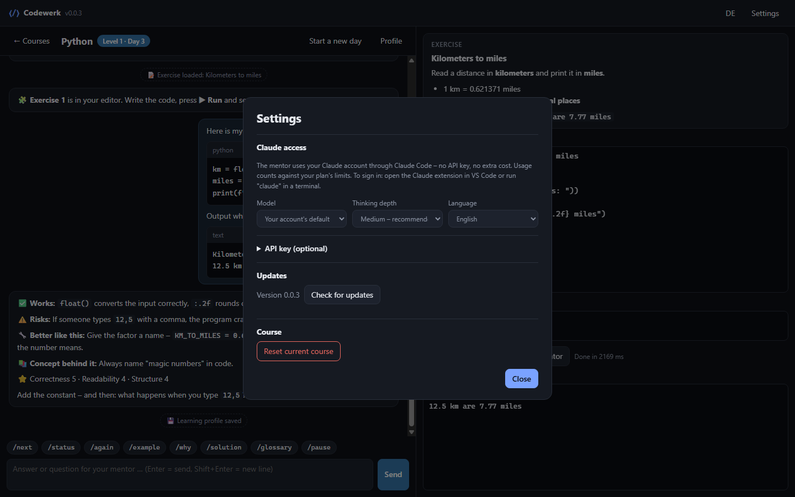
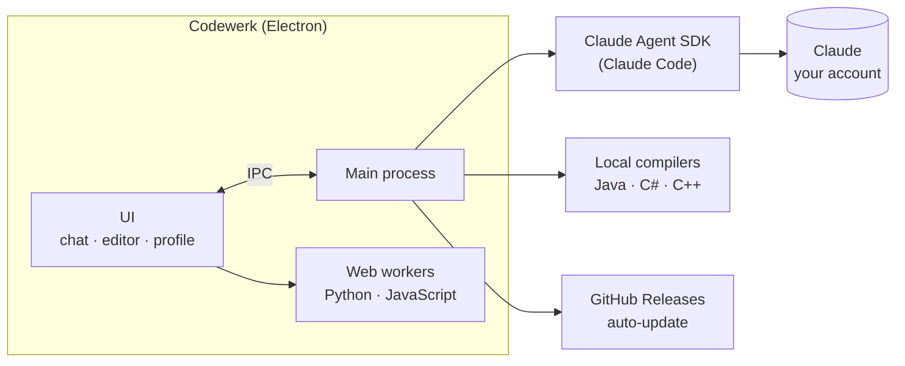
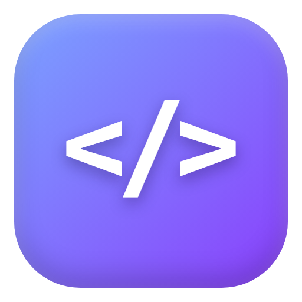

<p align="center">
  
</p>

<p align="center">
  <a href="README.md">🇩🇪 Deutsch</a> · 🇬🇧 English
</p>

<p align="center">
  <a href="https://github.com/MoinMornhart/Codewerk/releases/latest"></a>
  <a href="https://github.com/MoinMornhart/Codewerk/actions/workflows/test.yml"></a>
  
  
  
  
</p>

<p align="center">
  <a href="#download">Download</a> ·
  <a href="#how-a-learning-day-works">A learning day</a> ·
  <a href="#the-five-courses">Courses</a> ·
  <a href="#screenshots">Screenshots</a> ·
  <a href="#for-developers">For developers</a>
</p>

<p align="center"><sub><b>Codewerk version:</b> 0.0.4</sub></p>

---

**Codewerk** is a learning app for Windows. An AI mentor teaches you programming – from **level 0** (never seen code) to **level 10** (justifying and defending your own projects). One session every day, roughly one level per day, and at the end there is **a small game of your own**.

<p align="center">
  
  <br><sub>Chat with the mentor · exercise right in the editor · real output of your program</sub>
</p>

> [!TIP]
> The mentor **never hands you the solution right away**. It asks questions, nudges and gives tips – the full solution only comes when you explicitly type `/solution`. That way you really learn it yourself.

## Download

<a href="https://github.com/MoinMornhart/Codewerk/releases/latest"></a>

1. Download `Codewerk-Setup-x.y.z.exe` from the [releases page](https://github.com/MoinMornhart/Codewerk/releases/latest) and install it.
2. Be signed in to **Claude Code** with your Claude account (Pro or Max) – e.g. through the Claude extension in VS Code.
3. Start Codewerk, pick a course, **"Start the first day"**.

From then on the app updates itself.

> [!NOTE]
> The app is not signed, so Windows SmartScreen asks on the first start: **"More info" → "Run anyway"**.

## How a learning day works



1. **Start the day** – the mentor receives your saved learning profile and continues exactly where you left off.
2. **Learn in small steps** – everyday analogy, problem, minimal example, typical mistakes.
3. **Code yourself** – the mentor loads every exercise straight into the editor; you write, run and send the code with its real output for review.
4. **Improve together** – on mistakes the mentor explains the cause and guides you step by step to the solution.
5. **Keep your progress** – level, mistake list with reviews and glossary are saved automatically.

## The five courses

Every course is its own small app with its own level 0–10, learning profile, chat and archive. Recommended: one after another.

| Course | What for | Runs |
|:------:|----------|------|
|  | Getting started, automation, data – the best first language | ✅ right in the app |
|  | The language of the web – runs in every browser | ✅ right in the app |
|  | A classic in training programs and companies | JDK: `winget install Microsoft.OpenJDK.21` |
|  | Windows programs, tools and games with Unity | .NET: `winget install Microsoft.DotNet.SDK.10` |
|  | Close to the machine: fast and demanding | g++: `winget install BrechtSanders.WinLibs.POSIX.UCRT` |

## Screenshots

<table>
  <tr>
    <td width="50%"></td>
    <td width="50%"></td>
  </tr>
  <tr>
    <td align="center"><b>Home</b> – five courses as mini apps</td>
    <td align="center"><b>Learning profile</b> – level, mistake list, glossary</td>
  </tr>
  <tr>
    <td width="50%"></td>
    <td width="50%"></td>
  </tr>
  <tr>
    <td align="center"><b>Learning</b> – chat, editor, input, output</td>
    <td align="center"><b>Settings</b> – model, thinking depth, language, updates</td>
  </tr>
</table>

<sub>The screenshots show a sample learning day; the code in them is really executed while the images are made.</sub>

## Features

| | |
|---|---|
| 🧑‍🏫 **Strict but fair mentor** | Fixed rules: help escalation instead of ready-made solutions, code review format, level exams with an 80 % bar |
| ▶️ **Run code right away** | Python (Pyodide) and JavaScript without installation, Java/C#/C++ through local compilers, input box for `input()` and friends |
| ♾️ **Endless-loop protection** | Programs are stopped cleanly after a time limit |
| 📈 **Learning profile** | Level, progress, mastered and shaky topics, mistake list with reviews, glossary |
| ⌨️ **Course commands** | `/next` `/status` `/again` `/example` `/why` `/solution` `/glossary` `/pause` as buttons |
| 🌍 **German & English** | UI and mentor in both languages |
| 🔄 **Automatic updates** | New versions arrive through GitHub Releases by themselves |
| 🔒 **Your account, your data** | Runs on your Claude account, no API key; the mentor has no access to files or the command line |

## How it works



- The mentor runs through the **Claude Agent SDK** with your existing Claude login. It gets the mentor rules from [`prompts/mentor.en.md`](prompts/mentor.en.md) and exactly **two tools**: load an exercise into the editor and save the learning profile.
- Every learning day is its own session; earlier days are archived.
- Chats, profiles and settings live locally in `%APPDATA%\Codewerk\codewerk-data.json`. Usage counts against your Claude plan's limits. For people without a Claude account there is an optional API key field in the settings.

## For developers

<details>
<summary><b>Run, test, build graphics</b></summary>

```powershell
npm install        # install dependencies
npm start          # start the app
npm test           # unit tests
npm run selftest   # start the app hidden and check code execution
npm run graphics   # re-render banners, app icon and screenshots
```

</details>

<details>
<summary><b>Versions, updates and releases</b></summary>

Versions follow the counter system: every update raises the last digit by 1. When a digit would go above 9, it rolls over to 0 and the digit to its left increases by 1.

    0.0.1 → 0.0.2 → … → 0.0.9 → 0.1.0 → … → 0.9.9 → 1.0.0

```powershell
npm run bump -- --title "Short title" --de "Änderung 1" --en "Change 1"
npm run release
```

`bump` raises the version, adds the changes to [`CHANGELOG.md`](CHANGELOG.md) and [`CHANGELOG.en.md`](CHANGELOG.en.md), commits everything and sets the tag `vX.Y.Z`. `release` pushes, creates the GitHub release, builds and uploads the installer and publishes it – installed apps pick up the update automatically.

</details>

<details>
<summary><b>Git rules</b></summary>

Every update is its own commit. The title always names the new version; the body lists the changes in German and English:

    [Codewerk 0.0.3] Short title

    DE:
    - Änderung
    EN:
    - Change

</details>

<details>
<summary><b>Project structure</b></summary>

```
src/main/        main process: window, mentor (Claude Agent SDK), code execution, updates, storage
src/renderer/    UI: HTML, CSS, app logic, Markdown, translations, web workers
src/shared/      course list and version logic
prompts/         mentor instructions (German and English)
scripts/         bump.js, release.js, graphics.js
docs/            graphics for this README and their templates
test/            unit tests (node --test)
```

</details>

---

<p align="center">
  <br>
  <sub>Built with Electron, Pyodide and the Claude Agent SDK.</sub>
</p>
