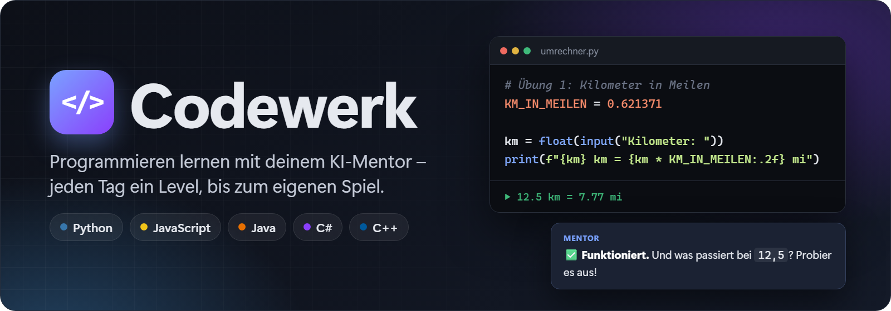
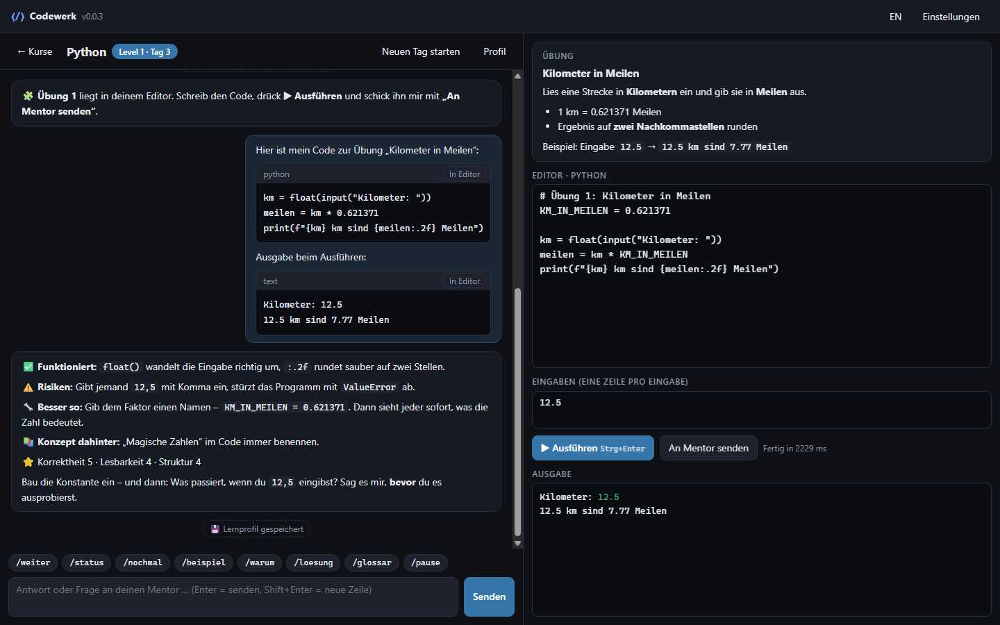
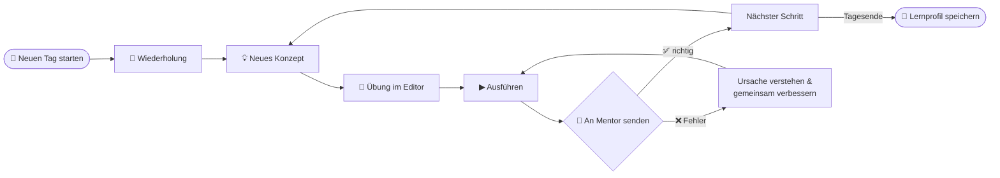
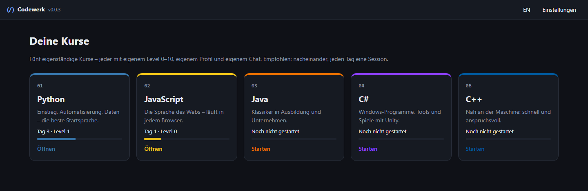
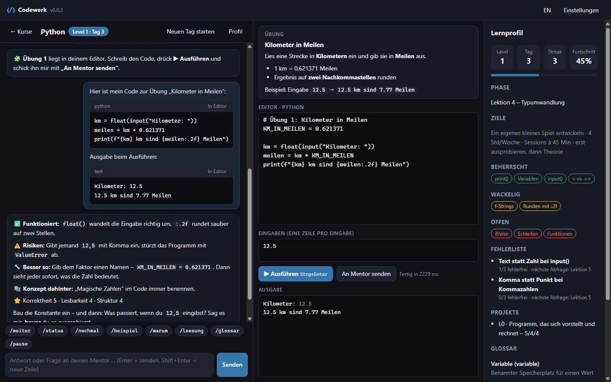
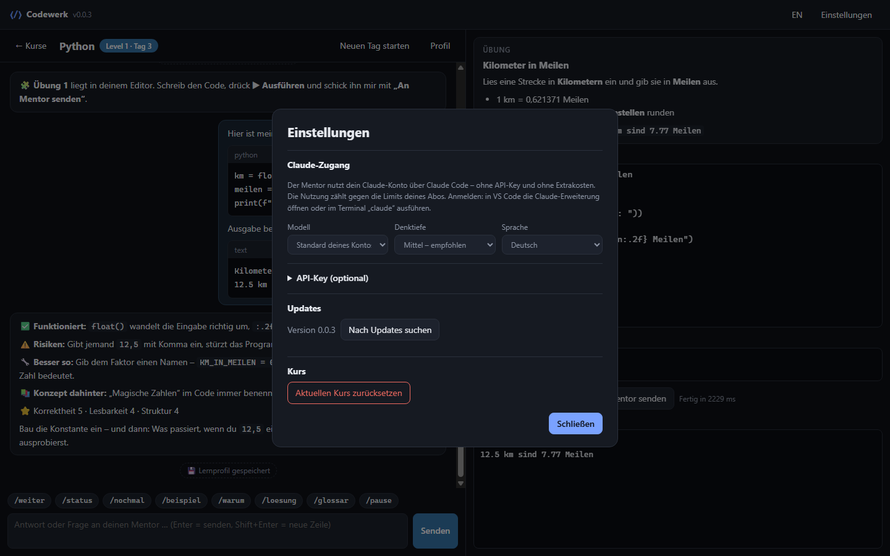
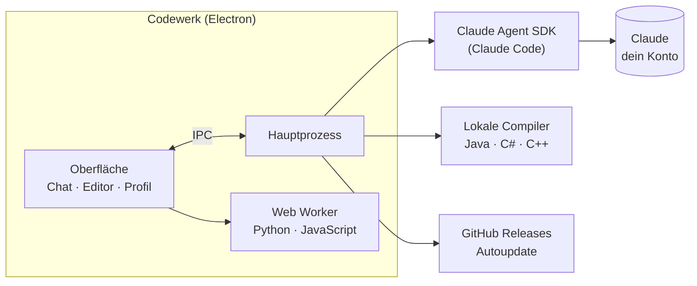

<p align="center">
  
</p>

<p align="center">
  🇩🇪 Deutsch · <a href="README.en.md">🇬🇧 English</a>
</p>

<p align="center">
  <a href="https://github.com/MoinMornhart/Codewerk/releases/latest"></a>
  <a href="https://github.com/MoinMornhart/Codewerk/actions/workflows/test.yml"></a>
  
  
  
  
</p>

<p align="center">
  <a href="#download">Download</a> ·
  <a href="#so-läuft-ein-lerntag">So läuft ein Lerntag</a> ·
  <a href="#die-fünf-kurse">Kurse</a> ·
  <a href="#screenshots">Screenshots</a> ·
  <a href="#für-entwickler">Für Entwickler</a>
</p>

<p align="center"><sub><b>Codewerk-Version:</b> 0.0.4</sub></p>

---

**Codewerk** ist eine Lern-App für Windows. Ein KI-Mentor bringt dir Programmieren bei – von **Level 0** (noch nie Code gesehen) bis **Level 10** (eigene Projekte begründen und verteidigen). Jeden Tag eine Session, ungefähr ein Level pro Tag, und am Ende steht dein **eigenes kleines Spiel**.

<p align="center">
  
  <br><sub>Chat mit dem Mentor · Übung direkt im Editor · echte Ausgabe deines Programms</sub>
</p>

> [!TIP]
> Der Mentor gibt dir **nie sofort die Lösung**. Er fragt nach, gibt Denkanstöße und Tipps – die fertige Lösung gibt es nur, wenn du ausdrücklich `/loesung` schreibst. So lernst du es wirklich selbst.

## Download

<a href="https://github.com/MoinMornhart/Codewerk/releases/latest"></a>

1. `Codewerk-Setup-x.y.z.exe` von der [Releases-Seite](https://github.com/MoinMornhart/Codewerk/releases/latest) laden und installieren.
2. In **Claude Code** mit deinem Claude-Konto (Pro oder Max) angemeldet sein – z. B. über die Claude-Erweiterung in VS Code.
3. Codewerk starten, Kurs wählen, **„Ersten Tag starten“**.

Ab dann aktualisiert sich die App selbst.

> [!NOTE]
> Die App ist nicht signiert. Windows SmartScreen fragt deshalb beim ersten Start nach: **„Weitere Informationen“ → „Trotzdem ausführen“**.

## So läuft ein Lerntag



1. **Tag starten** – der Mentor bekommt dein gespeichertes Lernprofil und setzt genau dort an, wo du aufgehört hast.
2. **Lernen in kleinen Schritten** – Alltagsvergleich, Problem, Minimalbeispiel, typische Fehler.
3. **Selbst coden** – der Mentor lädt jede Übung direkt in den Editor; du schreibst, führst aus und schickst den Code samt echter Ausgabe zur Prüfung.
4. **Gemeinsam verbessern** – bei Fehlern erklärt der Mentor die Ursache und führt dich Schritt für Schritt zur Lösung.
5. **Fortschritt sichern** – Level, Fehlerliste mit Wiederholungen und Glossar werden automatisch gespeichert.

## Die fünf Kurse

Jeder Kurs ist eine eigene kleine App mit eigenem Level 0–10, Lernprofil, Chat und Archiv. Empfohlen: nacheinander.

| Kurs | Wofür | Ausführung |
|:----:|-------|------------|
|  | Einstieg, Automatisierung, Daten – die beste Startsprache | ✅ direkt in der App |
|  | Die Sprache des Webs – läuft in jedem Browser | ✅ direkt in der App |
|  | Klassiker in Ausbildung und Unternehmen | JDK: `winget install Microsoft.OpenJDK.21` |
|  | Windows-Programme, Tools und Spiele mit Unity | .NET: `winget install Microsoft.DotNet.SDK.10` |
|  | Nah an der Maschine: schnell und anspruchsvoll | g++: `winget install BrechtSanders.WinLibs.POSIX.UCRT` |

## Screenshots

<table>
  <tr>
    <td width="50%"></td>
    <td width="50%"></td>
  </tr>
  <tr>
    <td align="center"><b>Startseite</b> – fünf Kurse als eigene Mini-Apps</td>
    <td align="center"><b>Lernprofil</b> – Level, Fehlerliste, Glossar</td>
  </tr>
  <tr>
    <td width="50%"></td>
    <td width="50%"></td>
  </tr>
  <tr>
    <td align="center"><b>Lernen</b> – Chat, Editor, Eingaben, Ausgabe</td>
    <td align="center"><b>Einstellungen</b> – Modell, Denktiefe, Sprache, Updates</td>
  </tr>
</table>

<sub>Die Screenshots zeigen einen Beispiel-Lerntag; der Code darin wird beim Erstellen der Bilder wirklich ausgeführt.</sub>

## Funktionen

| | |
|---|---|
| 🧑‍🏫 **Strenger, fairer Mentor** | Feste Regeln: Hilfe-Eskalation statt fertiger Lösungen, Code-Review-Format, Levelprüfungen mit 80 %-Grenze |
| ▶️ **Code direkt ausführen** | Python (Pyodide) und JavaScript ohne Installation, Java/C#/C++ über lokale Compiler, Eingabefeld für `input()` & Co. |
| ♾️ **Schutz vor Endlosschleifen** | Programme werden nach einem Zeitlimit sauber abgebrochen |
| 📈 **Lernprofil** | Level, Fortschritt, beherrschte und wackelige Themen, Fehlerliste mit Wiederholungen, Glossar |
| ⌨️ **Kursbefehle** | `/weiter` `/status` `/nochmal` `/beispiel` `/warum` `/loesung` `/glossar` `/pause` als Knöpfe |
| 🌍 **Deutsch & Englisch** | Oberfläche und Mentor in beiden Sprachen |
| 🔄 **Automatische Updates** | Neue Versionen kommen über GitHub Releases von selbst |
| 🔒 **Dein Konto, deine Daten** | Läuft über dein Claude-Konto, kein API-Key; der Mentor hat keinen Zugriff auf Dateien oder die Kommandozeile |

## Wie es funktioniert



- Der Mentor läuft über das **Claude Agent SDK** mit deinem bestehenden Claude-Login. Er bekommt die Mentor-Regeln aus [`prompts/mentor.de.md`](prompts/mentor.de.md) und genau **zwei Werkzeuge**: Übung in den Editor laden und Lernprofil speichern.
- Jeder Lerntag ist eine eigene Sitzung; frühere Tage werden archiviert.
- Chats, Profile und Einstellungen liegen lokal in `%APPDATA%\Codewerk\codewerk-data.json`. Die Nutzung zählt gegen die Limits deines Claude-Abos. Für Personen ohne Claude-Konto gibt es in den Einstellungen ein optionales Feld für einen API-Key.

## Für Entwickler

<details>
<summary><b>Starten, testen, Grafiken bauen</b></summary>

```powershell
npm install        # Abhängigkeiten installieren
npm start          # App starten
npm test           # Unit-Tests
npm run selftest   # App unsichtbar starten und Code-Ausführung prüfen
npm run graphics   # Banner, App-Icon und Screenshots neu erzeugen
```

</details>

<details>
<summary><b>Versionen, Updates und Releases</b></summary>

Versionen folgen dem Zähler-System: Jede Aktualisierung erhöht die letzte Stelle um 1. Wird eine Stelle größer als 9, springt sie auf 0 und die Stelle links davon wird um 1 erhöht.

    0.0.1 → 0.0.2 → … → 0.0.9 → 0.1.0 → … → 0.9.9 → 1.0.0

```powershell
npm run bump -- --title "Kurzer Titel" --de "Änderung 1" --en "Change 1"
npm run release
```

`bump` erhöht die Version, trägt die Änderungen in [`CHANGELOG.md`](CHANGELOG.md) und [`CHANGELOG.en.md`](CHANGELOG.en.md) ein, committet alles und setzt den Tag `vX.Y.Z`. `release` pusht, legt den GitHub-Release an, baut den Installer, lädt ihn hoch und veröffentlicht – installierte Apps holen sich das Update automatisch.

</details>

<details>
<summary><b>Git-Regeln</b></summary>

Jede Aktualisierung ist ein eigener Commit. Der Titel nennt immer die neue Version, der Text listet die Änderungen auf Deutsch und Englisch:

    [Codewerk 0.0.3] Kurzer Titel

    DE:
    - Änderung
    EN:
    - Change

</details>

<details>
<summary><b>Projektstruktur</b></summary>

```
src/main/        Hauptprozess: Fenster, Mentor (Claude Agent SDK), Code-Ausführung, Updates, Speicher
src/renderer/    Oberfläche: HTML, CSS, App-Logik, Markdown, Übersetzungen, Web Worker
src/shared/      Kursliste und Versionslogik
prompts/         Mentor-Anweisungen (Deutsch und Englisch)
scripts/         bump.js, release.js, graphics.js
docs/            Grafiken für dieses README und ihre Vorlagen
test/            Unit-Tests (node --test)
```

</details>

---

<p align="center">
  <br>
  <sub>Gebaut mit Electron, Pyodide und dem Claude Agent SDK.</sub>
</p>
